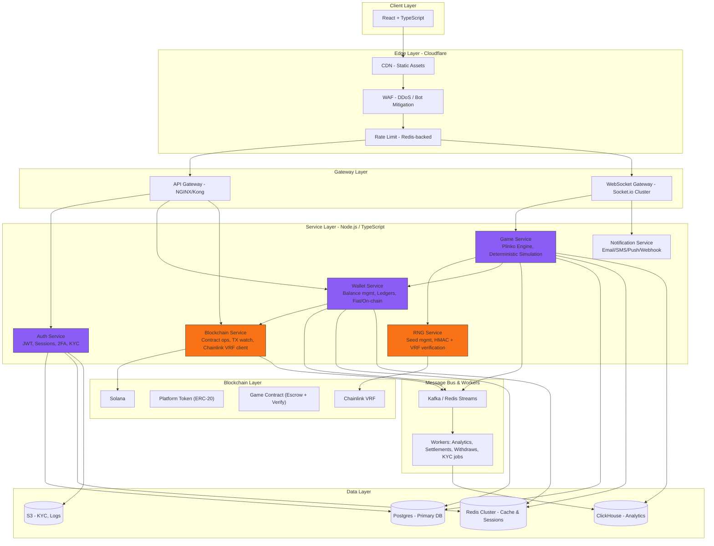

# Gambling Website

- **Project:** Build a complex gaming website for profit, similar to Stake
- **Reference:** [Stake-plinko](https://stake.bet/casino/games/plinko?c=okbrvplink3Ind)

[Jargon/Simulation](https://github.com/NalinDalal/plinko-simulation)

**Version:** Final
**Last updated:** 2025-10-18

## 1) High-level Architecture (Mermaid)



---

## 3) Key Design Decisions (short)

- **Hybrid approach**: Fast game loop off-chain (Web2) + on-chain anchoring for fairness and optional on-chain bets.
- **Provably fair**: Server publishes `serverSeedHash` prior to a betting session, signs `serverSeed` after outcome, client seed + server seed deterministic simulation. Optionally verify with Chainlink VRF when high-value bets requested.
- **Wallet model**: Ledger-first — use a double-entry ledger in DB as source of truth; on-chain reconciled asynchronously.
- **Scaling**: WebSocket gateway scale horizontally with sticky sessions (or token-based reconnection), Kafka for event-driven settlement, ClickHouse for analytics.
- **Security**: KYC for withdrawals, rate-limits, hardware HSMs for key storage, signed proofs for seeds.

---

## 4) Minimal API & WebSocket Contracts (examples)

### REST — Auth

`POST /api/v1/auth/signup`

Request:

```json
{ "email": "user@example.com", "password": "hunter2" }
```

Response 200:

```json
{ "message": "Welcome", "userId": "userId" }
```

`POST /api/v1/auth/login`

Request:

```json
{ "email": "user@example.com", "password": "hunter2" }
```

Response 200:

```json
{
  "token": "eyJhbGci...",
  "refreshToken": "...",
  "user": { "id": "u_123", "username": "nalin" }
}
```

refresh token is till the tab is on, as soon as tab is closed, the token gets revoked

---

### REST — Wallet

`POST /api/v1/wallet/deposit-notify?gameId=<gameId>` (internal webhook from payment provider)

Request:

```json
{
  "gameId": "gameId",
  "txId": "tx_abc",
  "userId": "u_123",
  "amount": 100000,
  "currency": "USD",
  "status": "confirmed",
  "message": "You have deposited $1000.00 "
}
```

Response 200:

```json
{ "ok": true, "transaction ID": "txId" }
```

---

### WebSocket — Game channel (events)

Connect: `wss://api.example.com/ws?token=<JWT>&gameId=<gameId>`

Subscribe: `{"game_id":"gameId","action":"subscribe"}`

---

### Game no 1- `dice game`

choose a no b/w 1-125
u get 3 chances, with some hints
then if correct on:

- 1st guess: 5x
- 2nd guess: 3x
- 3rd guess: 1.15x

else return 0
dockerised the app, start impementing db

### Game no 2 - `tiles`

5x5 tiles,
n no of tiles have bomb, rest diamonds, if you pick bomb in any turn lost
else if you get diamonds then u win some multipleir for the bet

### Game no 3 - `minesweeper`

4x4 tiles
u select a tile, if that's no, put bomb someplace, u can either cash out or play till losing
u played if safe then +0.15, else lose
then again play so +0.5, else lose

addictive,

### Game no 4 - `tiles2`/`linex tiles game`

select a tile, num b/w 0-8
Usme ek number aayega
0-8 k beech
Uske 8tho direction mein utni tiles mein bomb h
Jitna number aaya
Samjha ?
Jese maan le 2 aaya
Toh 2 tiles mein bomb h uske adjacent ki
so let’s say 1st row 1st col select kra, 1 aaya
to uske baju ki 3 tile me koi bhi 1 me bomb hoga
ending: Bomb click hua toh haar gaye warna jeet gaye till Bomb ko chd kr saari tiles bhar jayengi

### Game no 5 -

ek 3 digit number decide krle
Uss order mein aaya toh Jeet Gaye
Baaki ek bhi digit uski sahi position mein aaya toh 1.2 x krde
Fir 1.5
Last mein 2x

jese mene rkha 2 4 1
to agar phlee pr 2 aaya to cash out
nhi to maa chudao

then agar sirf 2 sahi aaya to 1.2x
2,4 to 1.5x
2,4,1 to 2x

Baaki sab pr loss
ek bhi galat to gaand mr li jygegi
First digit ki - 5% only

---

## **Game 1 — Dice Game**

**Type:** Guess number (1–125)
**Mechanics:**

- User picks a number between 1–125
- 3 chances per game
- Server provides hints: "Higher ⬆️" / "Lower ⬇️"
- Payout multiplier:
  - 1st guess correct → 5×
  - 2nd guess correct → 3×
  - 3rd guess correct → 1.15×

- Lose all if not guessed after 3 tries

**API Routes:**

- `POST /api/v1/game/dice/start` → start game
- `POST /api/v1/game/dice/guess` → submit guess

**DB Fields (GameSession):** `targetNumber`, `currentTry`, `multiplier`, `status`

---

## **Game 2 — Tiles Game**

**Type:** 5×5 tile grid
**Mechanics:**

- Grid: 25 tiles
- `n` tiles are bombs, rest are diamonds
- Click on diamond → continue, multiplier grows
- Click on bomb → lose immediately
- User can cash out anytime to secure current multiplier

**Payout:** multiplier curve per safe tile selected, e.g., `[1, 1.1, 1.25, 1.45, ...]`

**API Routes:**

- `POST /api/v1/game/tiles/start` → start game
- `POST /api/v1/game/tiles/move` → reveal tile
- `POST /api/v1/game/tiles/cashout` → cash out

**DB Fields (GameSession):** `bombTiles`, `revealed`, `multiplier`, `status`

---

## **Game 3 — Mini Minesweeper**

**Type:** 4×4 tile grid (simplified Minesweeper)
**Mechanics:**

- Click a tile:
  - If safe → multiplier grows (+0.15 first, +0.5 second, etc.)
  - If bomb → lose immediately

- Option to **cash out** after each safe click
- Game ends when bomb clicked or user cashes out

**API Routes:**

- `POST /api/v1/game/minesweeper/start`
- `POST /api/v1/game/minesweeper/move`
- `POST /api/v1/game/minesweeper/cashout`

**DB Fields:** `revealed`, `bombTiles`, `multiplier`, `status`

---

## **Game 4 — Tiles2 / Linex Tiles Game**

**Type:** 5×5 tile grid, adjacent bombs based on revealed number
**Mechanics:**

- Click tile → server returns a number `0–8`
- That number = bombs placed randomly in the **8 adjacent tiles**
- Click on bomb → lose
- Click on safe → continue until all tiles revealed or bomb hit
- Optional: user can cash out anytime

**API Routes:**

- `POST /api/v1/game/tiles2/start`
- `POST /api/v1/game/tiles2/move`
- `POST /api/v1/game/tiles2/cashout`

**DB Fields:** `revealed`, `bombTiles`, `multiplier`, `status`

---

## **Game 5 — 3-Digit Sequence Game**

**Type:** Predict sequence of 3 digits
**Mechanics:**

- Server generates 3-digit sequence, e.g., `2 4 1`
- Player submits 3-digit guess
- Payout multipliers:
  - All digits in exact order → 2×
  - 2 digits correct in order → 1.5×
  - 1 digit correct in position → 1.2×
  - Any other → lose

- Probability for **first digit correct** = 5% (server edge)
- Cash out possible after each partially correct match

**API Routes:**

- `POST /api/v1/game/sequence/start`
- `POST /api/v1/game/sequence/guess`
- `POST /api/v1/game/sequence/cashout`

**DB Fields:** `targetSequence`, `currentTry`, `multiplier`, `status`

---

## **Common Features Across All Games**

- DB Table: `game_sessions` (one table handles all games, `gameType` field differentiates)
- Status values: `playing`, `won`, `lost`, `cashout`
- Multiplier calculation abstracted to **core engine** per game
- Dockerized + ready for monorepo deployment
- REST APIs easily upgradeable to WebSocket for real-time play
- Scalable, isolated services: ready for microservice separation

---

to run:
`docker compose up -d`

to generate and migrate prisma client, do this:

1. go to /packages/prisma, copy over .env.example to .env
   then run : ` bunx prisma migrate dev` and `bun run seed.ts` to migrate and seed db
