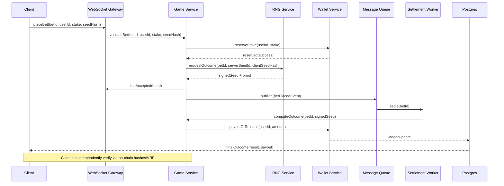

# Gambling Website

- **Project:** Build a complex gaming website for profit, similar to Stake
- **Reference:** [Stake-plinko](https://stake.bet/casino/games/plinko?c=okbrvplink3Ind)

[Jargon/Simulation](https://github.com/NalinDalal/plinko-simulation)

**Version:** Final
**Last updated:** 2025-10-18

## 1) High-level Architecture (Mermaid)

```mermaid
%% System Architecture - Refined
flowchart TB
  subgraph CLIENT[Client Layer]
    A1[Next.js Web App\n(SSR + SPA)\nReact + TypeScript]
    A2[Mobile App\n(React Native)]
    A3[Electron Desktop]
  end

  subgraph EDGE[Edge Layer - Cloudflare]
    B1[CDN - Static Assets]
    B2[WAF - DDoS / Bot Mitigation]
    B3[Rate Limit - Redis-backed]
  end

  subgraph GATEWAY[Gateway Layer]
    C1[API Gateway - NGINX/Kong]\n
    C2[WebSocket Gateway - Socket.io Cluster]\n
  end

  subgraph SERVICES[Service Layer - Node.js / TypeScript]
    D1[Auth Service\nJWT, Sessions, 2FA, KYC]:::svc
    D2[Game Service\nPlinko Engine, Deterministic Simulation]:::svc
    D3[Wallet Service\nBalance mgmt, Ledgers, Fiat/On-chain]:::svc
    D4[RNG Service\nSeed mgmt, HMAC + VRF verification]:::svc
    D5[Blockchain Service\nContract ops, TX watch, Chainlink VRF client]:::svc
    D6[Notification Service\nEmail/SMS/Push/Webhook]:::svc
  end

  subgraph MQ[Message Bus & Workers]
    E1[Kafka / Redis Streams]
    E2[Workers: Analytics, Settlements, Withdraws, KYC jobs]
  end

  subgraph DATA[Data Layer]
    F1[(Postgres - Primary DB)]
    F2[(Redis Cluster - Cache & Sessions)]
    F3[(ClickHouse - Analytics)]
    F4[(S3 - KYC, Logs)]
  end

  subgraph CHAIN[Blockchain Layer]
    G1[Polygon / Arbitrum / Base]\n    G2[PlatformToken (ERC-20)]
    G3[Game Contract (Escrow + Verify)]
    G4[Chainlink VRF]
  end

  subgraph OBS[Monitoring]
    H1[Datadog / CloudWatch / Sentry]
  end

  %% Client -> Edge
  A1 --> B1
  A2 --> B1
  A3 --> B1
  B1 --> B2
  B2 --> B3

  %% Edge -> Gateway
  B3 --> C1
  B3 --> C2

  %% Gateway -> Services
  C1 --> D1
  C1 --> D3
  C1 --> D5
  C2 --> D2
  C2 --> D6

  %% Service interactions
  D2 --> D4
  D2 --> D3
  D3 --> D5
  D5 --> G1
  D4 --> G4

  %% Services -> MQ -> Workers
  D2 --> E1
  D3 --> E1
  D5 --> E1
  E1 --> E2
  E2 --> F3

  %% Services -> Data
  D1 --> F1
  D2 --> F1
  D3 --> F1
  D1 --> F2
  D2 --> F2
  D3 --> F2
  D2 --> F3
  D1 --> F4

  %% Monitoring
  D1 -.-> H1
  D2 -.-> H1
  D3 -.-> H1
  F1 -.-> H1

  style D1 fill:#8b5cf6,stroke:#333,stroke-width:1px
  style D2 fill:#8b5cf6,stroke:#333,stroke-width:1px
  style D3 fill:#8b5cf6,stroke:#333,stroke-width:1px
  style D4 fill:#f97316,stroke:#333,stroke-width:1px
  style D5 fill:#f97316,stroke:#333,stroke-width:1px
```

---

## 2) Bet Flow Sequence (Mermaid Sequence)



---

## 3) Key Design Decisions (short)

- **Hybrid approach**: Fast game loop off-chain (Web2) + on-chain anchoring for fairness and optional on-chain bets.
- **Provably fair**: Server publishes `serverSeedHash` prior to a betting session, signs `serverSeed` after outcome, client seed + server seed deterministic simulation. Optionally verify with Chainlink VRF when high-value bets requested.
- **Wallet model**: Ledger-first — use a double-entry ledger in DB as source of truth; on-chain reconciled asynchronously.
- **Scaling**: WebSocket gateway scale horizontally with sticky sessions (or token-based reconnection), Kafka for event-driven settlement, ClickHouse for analytics.
- **Security**: KYC for withdrawals, rate-limits, hardware HSMs for key storage, signed proofs for seeds.

---

## 4) Minimal API & WebSocket Contracts (examples)

### REST — Auth

`POST /api/v1/auth/login`

Request:

```json
{ "email": "user@example.com", "password": "hunter2" }
```

Response 200:

```json
{
  "token": "eyJhbGci...",
  "refreshToken": "...",
  "user": { "id": "u_123", "username": "nalin" }
}
```

---

### REST — Wallet

`POST /api/v1/wallet/deposit-notify` (internal webhook from payment provider)

Request:

```json
{
  "txId": "tx_abc",
  "userId": "u_123",
  "amount": 100000,
  "currency": "USD",
  "status": "confirmed"
}
```

Response 200:

```json
{ "ok": true }
```

---

### WebSocket — Game channel (events)

Connect: `wss://api.example.com/ws?token=<JWT>`

Subscribe: `{"action":"subscribe"}`
