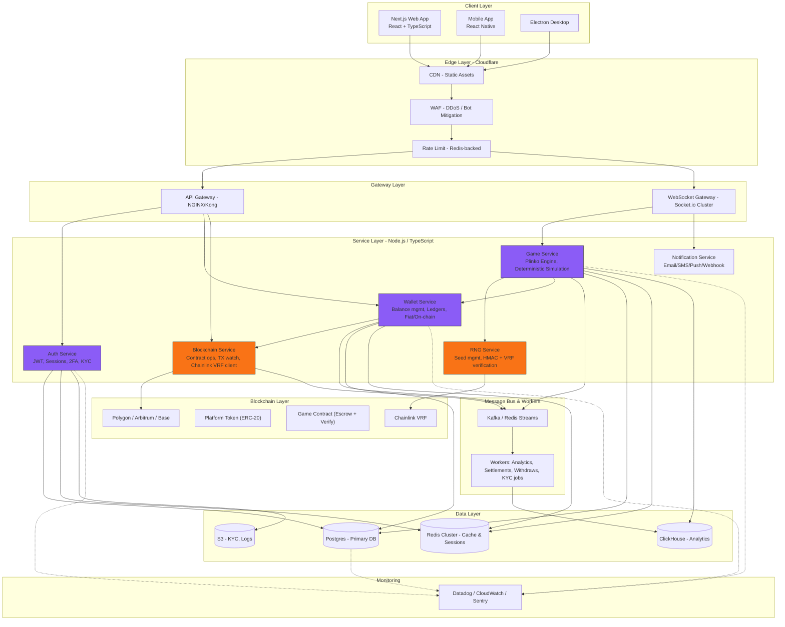

# Gambling Website

- **Project:** Build a complex gaming website for profit, similar to Stake
- **Reference:** [Stake-plinko](https://stake.bet/casino/games/plinko?c=okbrvplink3Ind)

[Jargon/Simulation](https://github.com/NalinDalal/plinko-simulation)

**Version:** Final
**Last updated:** 2025-10-18

## 1) High-level Architecture (Mermaid)



---

## 3) Key Design Decisions (short)

- **Hybrid approach**: Fast game loop off-chain (Web2) + on-chain anchoring for fairness and optional on-chain bets.
- **Provably fair**: Server publishes `serverSeedHash` prior to a betting session, signs `serverSeed` after outcome, client seed + server seed deterministic simulation. Optionally verify with Chainlink VRF when high-value bets requested.
- **Wallet model**: Ledger-first — use a double-entry ledger in DB as source of truth; on-chain reconciled asynchronously.
- **Scaling**: WebSocket gateway scale horizontally with sticky sessions (or token-based reconnection), Kafka for event-driven settlement, ClickHouse for analytics.
- **Security**: KYC for withdrawals, rate-limits, hardware HSMs for key storage, signed proofs for seeds.

---

## 4) Minimal API & WebSocket Contracts (examples)

### REST — Auth

`POST /api/v1/auth/login`

Request:

```json
{ "email": "user@example.com", "password": "hunter2" }
```

Response 200:

```json
{
  "token": "eyJhbGci...",
  "refreshToken": "...",
  "user": { "id": "u_123", "username": "nalin" }
}
```

---

### REST — Wallet

`POST /api/v1/wallet/deposit-notify` (internal webhook from payment provider)

Request:

```json
{
  "txId": "tx_abc",
  "userId": "u_123",
  "amount": 100000,
  "currency": "USD",
  "status": "confirmed"
}
```

Response 200:

```json
{ "ok": true }
```

---

### WebSocket — Game channel (events)

Connect: `wss://api.example.com/ws?token=<JWT>`

Subscribe: `{"action":"subscribe"}`
